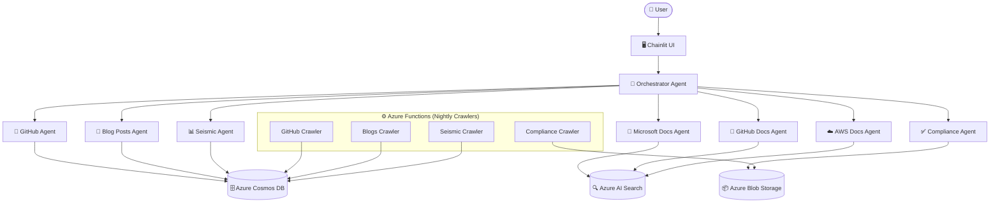

# 🤖 STU Copilot

STU Copilot is an AI-powered assistant built for Microsoft technology teams. It provides a conversational interface backed by a multi-agent architecture, enabling users to search GitHub repositories, Microsoft & AWS documentation, blog posts, Seismic presentations, and compliance content — all from a single chat interface.

---

## 📐 Architecture Overview

STU Copilot follows a **hierarchical multi-agent** pattern:

- An **Orchestrator Agent** handles the conversation and delegates tasks to specialized sub-agents.
- Sub-agents are each focused on a specific domain and backed by Azure AI Foundry (GPT-5.2 / GPT-4.1-mini).
- A separate set of **Azure Function crawlers** indexes data into Azure Cosmos DB, making it searchable via hybrid (vector + keyword) search.



---

## ✨ Features

| Feature | Description |
|---|---|
| 🔍 GitHub Search | Search indexed GitHub repositories by topic |
| 📄 Microsoft Docs | Search official Microsoft documentation |
| 📄 GitHub Docs | Search GitHub's official documentation |
| ☁️ AWS Docs | Search AWS documentation |
| 📝 Blog Posts | Search crawled Microsoft/tech blog posts |
| 📊 Seismic Presentations | Search internal Seismic content |
| ✅ Compliance | Compliance document search and analysis workflow |
| 🔐 Authentication | Microsoft Entra ID (OAuth) login |
| 📡 MCP Support | Model Context Protocol (MCP) tool integration |

---

## 🗂️ Project Structure

```
├── src/
│   ├── app/                    # Chainlit web application
│   │   ├── app.py              # Entry point, OAuth & chat event handlers
│   │   ├── services/
│   │   │   ├── agent_factory.py        # Creates and wires all agents
│   │   │   ├── chat_service.py         # Chat commands and agent routing
│   │   │   ├── tool_factory.py         # Cosmos DB search tools
│   │   │   ├── compliance_workflow.py  # Compliance multi-step workflow
│   │   │   ├── cosmos_db_service.py    # Cosmos DB client
│   │   │   ├── foundry_service.py      # Azure AI Foundry client
│   │   │   └── cache_service.py        # Prompt caching
│   │   └── prompts/            # .prompty files for each agent
│   └── crawlers/               # Azure Functions data ingestion
│       ├── function_app.py     # Timer-triggered crawler functions
│       ├── github_crawler.py   # Crawls GitHub organisations
│       ├── blogs_crawler.py    # Crawls tech blog posts
│       ├── compliance_crawler.py # Crawls compliance documents
│       └── seismic_crawler.py  # Crawls Seismic content (optional)
├── infra/                      # Azure Bicep infrastructure
│   ├── main.bicep              # Subscription-level deployment
│   └── modules/                # Individual resource modules
├── architecture/               # Architecture docs and diagrams
└── pgsql/                      # PostgreSQL schema (Chainlit tables)
```

---

## 🏗️ Infrastructure

Deployed via Azure Bicep to a subscription-scoped resource group (`rg-<env>-stu-copilot`):

| Resource | Purpose |
|---|---|
| Azure AI Foundry | LLM model hosting & project endpoint |
| Azure AI Search | Hybrid vector + keyword search |
| Azure Cosmos DB | Storage for repos, blog posts, seismic content |
| Azure Storage Account | Blob storage for compliance documents |
| Azure Key Vault | Secrets management |
| Azure Container Registry | Docker image registry |
| Application Insights + Log Analytics | Observability & telemetry |

---

## 🤖 Agents

| Agent | Model | Description |
|---|---|---|
| `orchestrator_agent` | gpt-5.2-chat | Routes requests to sub-agents |
| `github_agent` | gpt-4.1-mini | Searches GitHub repositories |
| `github_docs_search_agent` | gpt-4.1-mini | Searches GitHub documentation |
| `microsoft_docs_agent` | gpt-4.1-mini | Searches Microsoft documentation |
| `blog_posts_agent` | gpt-4.1-mini | Searches blog posts |
| `seismic_agent` | gpt-4.1-mini | Searches Seismic presentations |
| `aws_docs_agent` | gpt-4.1-mini | Searches AWS documentation |
| `compliance_agent` | gpt-4.1-mini | Compliance document workflow |

---

## ⚙️ Crawlers (Azure Functions)

Data is indexed nightly (midnight UTC) via timer-triggered Azure Functions:

| Function | Schedule | Description |
|---|---|---|
| `github_crawler_func` | Daily midnight | Fetches repos from GitHub orgs, generates embeddings, stores in Cosmos DB |
| `blogs_crawler_func` | Daily midnight | Crawls blog posts and stores in Cosmos DB |
| `compliance_crawler_func` | Daily midnight | Downloads compliance documents to Azure Blob Storage |
| `seismic_crawler_func` | Disabled | Crawls Seismic content (optional, currently disabled) |

---

## 🚀 Getting Started

### Prerequisites

- Python 3.11+
- [Azure Functions Core Tools](https://learn.microsoft.com/azure/azure-functions/functions-run-local)
- Azure subscription with the required resources deployed (see `infra/`)
- A `.env` file configured with the required environment variables

### 1. Deploy Infrastructure

```bash
az deployment sub create \
  --location swedencentral \
  --template-file infra/main.bicep \
  --parameters infra/parameters_dev.json
```

### 2. Run the App

```bash
# Install dependencies
pip install -r src/app/requirements.txt

# Start the Chainlit app
cd src/app
chainlit run app.py
```

### 3. Run the Crawlers Locally

```bash
# Install dependencies
pip install -r src/crawlers/requirements.txt

# Start Azure Functions host
cd src/crawlers
func host start
```

> **Note:** Azurite (local Azure Storage emulator) must be running for local crawler development. A pre-configured `AzuriteConfig` is included in the repo root.

---

## 🔑 Environment Variables

Create a `.env` file in `src/app/` and `src/crawlers/` with the following variables:

| Variable | Description |
|---|---|
| `AI_FOUNDRY_PROJECT_ENDPOINT` | Azure AI Foundry project endpoint URL |
| `AZURE_OPENAI_ENDPOINT` | Azure OpenAI endpoint URL |
| `COSMOSDB_ENDPOINT` | Azure Cosmos DB account endpoint |
| `AZURE_SEARCH_ENDPOINT` | Azure AI Search endpoint |
| `AZURE_STORAGE_ACCOUNT_URL` | Azure Blob Storage URL |
| `GITHUB_TOKEN` | GitHub personal access token for crawling |
| `CHAINLIT_AUTH_SECRET` | Secret for Chainlit session signing |
| `AZURE_CLIENT_ID` | App registration client ID (OAuth) |

---

## 🐳 Docker

A `Dockerfile` is provided for containerising the Chainlit app:

```bash
docker build -t stu-copilot .
docker run -p 8000:8000 --env-file src/app/.env stu-copilot
```

---

## 📊 Observability

The app is instrumented with **Azure Application Insights** via OpenTelemetry. Traces, logs, and metrics are exported automatically when `APPLICATIONINSIGHTS_CONNECTION_STRING` is set.

